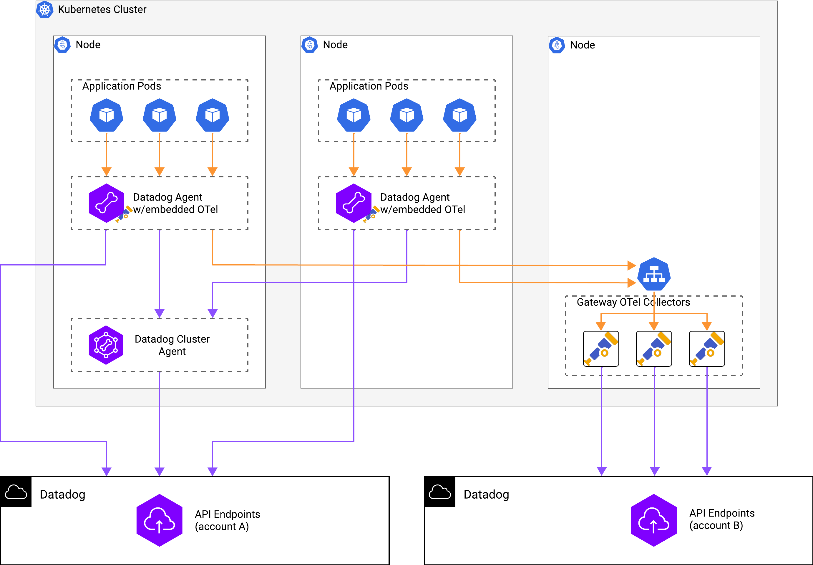

# Connect the Agent with embedded OTel collector to the OTel gateway

## Goal 

Dual ship telemetry data via Agent with embedded collector and OTel gateway to multiple Datadog accounts:



## Prerequisites

1. Kubernetes cluster
2. Helm

## Steps

### 1. Install/update helm

[Install Helm](https://helm.sh/docs/intro/install/), [Datadog](https://github.com/DataDog/Helm-charts/)'s and [OpenTelemetry](https://github.com/open-telemetry/opentelemetry-helm-charts) charts

```shell
helm repo add datadog https://helm.datadoghq.com
helm repo add open-telemetry https://open-telemetry.github.io/opentelemetry-helm-charts
helm repo update
```

### 2. Deploy OTel collector as a gateway

For the purpose of this project, we need to use DNS-based load-balancing exporter in the first tier of OTel collector (embedded 
collector in the Datadog agent). To be able to do that, will deploy `opentelemetry-collector-contrib` as headless service:

```yaml
spec:
  clusterIP: None
```

Unfortunately, official [OpenTelemetry](https://github.com/open-telemetry/opentelemetry-helm-charts) Helm chart doesn't 
support this option, so we'll have to generate teplate manifests from Helm and add `clusterIP: None` manually:

```shell
helm template collector-gw open-telemetry/opentelemetry-collector \
  --namespace demo-zapus \
  --values ./collector-gateway/otel-values.yaml \
  --set nodeSelector."alpha\\.eksctl\\.io/nodegroup-name"=mng-demo-zapus \
  --output-dir ./collector-gateway/k8s
```

### 3. Deploy Demo app:

We will use [Calendar REST Service](https://github.com/DataDog/opentelemetry-examples/tree/main/apps/rest-services/java/calendar) 
as a demo app. To install it via Helm, run:

```shell
helm upgrade -i calendar-hippo ./deploys/calendar/ \
  --namespace calendar-hippo \
  --set image.repository=datadog/opentelemetry-examples \
  --set image.tag=calendar-java-20240916 \
  --set replicaCount=2 \
  --set resources.requests.cpu=200m \
  --set resources.requests.memory=500M \
  --set nodeSelector."alpha\\.eksctl\\.io/nodegroup-name"=mng-calendar-hippo
```

[Generated manifests](./calendar).

### 4. Install Datadog Agent with embedded OTel collector

Create and provide a secret that contains your Datadog API and APP Keys for the first Datadog account:

```shell
k create secret generic datadog-secret --from-literal api-key=<ACCOUNT_1_API_KEY> --from-literal app-key=<ACCOUNT_1_APP_KEY>
```

Install the agent via Helm:

```shell
helm upgrade -i agent-hippo datadog/datadog \
  --namespace calendar-hippo \
  --values datadog-values.yaml \
  --set-file datadog.otelCollector.config=collector-config.yaml \
  --set agents.nodeSelector."alpha\\.eksctl\\.io/nodegroup-name"=mng-calendar-hippo
```

[Generated manifests](./datadog).

### 5. Verify Agent installation

Go to app.datadoghq.com and verify telemetry data via:
* OpenTelemetry Collector Metrics Dashboard
* Fleet Automation
* Traces/Metrics/Logs explorer

### 6. Build BYOC collector

The [load-balancing exporter](https://github.com/open-telemetry/opentelemetry-collector-contrib/tree/main/exporter/loadbalancingexporter) 
is not included in the list of OTel components Agent with embedded collector ships with.
To add, we need to follow [Bring Your Own Components (BYOC)](https://docs.datadoghq.com/opentelemetry/agent/agent_with_custom_components/)
flow:

#### Download BYOC manifest file

```shell
curl -o manifest.yaml https://raw.githubusercontent.com/DataDog/datadog-agent/main/comp/otelcol/collector-contrib/impl/manifest.yaml
```

#### Download BYOC Docker file

```shell
curl -o Dockerfile.byoc https://raw.githubusercontent.com/DataDog/datadog-agent/main/Dockerfiles/agent-ot/Dockerfile.agent-otel
```

#### Build BYOC image

```shell
docker build --file Dockerfile.byoc --tag agent-byoc:0.104.0 .
```

#### Publish BYOC image to the registry:

```shell
docker tag agent-byoc:0.104.0 601427279990.dkr.ecr.us-east-2.amazonaws.com/krlv/agent-byoc:0.104.0
docker push 601427279990.dkr.ecr.us-east-2.amazonaws.com/krlv/agent-byoc:0.104.0
```

### 7. Use BYOC Agent image

Use the image we've built on a previous step in the Helm values file:

```yaml
# datadog-values.yaml
agents:
  image:
    repository: 601427279990.dkr.ecr.us-east-2.amazonaws.com/krlv/agent-byoc
    tag: 0.104.0
```

### 8. Connect Agent with OTel collector to `collector-contrib` deployed as a gateway

```yaml
# collecotr-config.yaml
...
exporters:
  ...
  loadbalancing:
    protocol:
      otlp:
        tls:
          insecure: true
    resolver:
      dns:
        hostname: collector-gw-opentelemetry-collector.demo-zapus.svc.cluster.local

  pipelines:
    traces:
      ...
      exporters: [debug, datadog, datadog/connector, loadbalancing]
    logs:
      ...
      exporters: [debug, datadog, loadbalancing]

```

### 9. Connect OTel Gateway to the second Datadog account

Create and provide a secret that contains your Datadog API and APP Keys for the second Datadog account:

```shell
k create secret generic datadog-secret --from-literal api-key=<ACCOUNT_2_API_KEY> --from-literal app-key=<ACCOUNT_2_APP_KEY>
```

Add Datadog exporter to the OTel Gateway config:

```yaml
# collector-gateway/otel-values.yaml
config:
  ...
  exporters:
    datadog:
      api:
        key: ${env:DD_API_KEY}
  ...
extraEnvs:
  - name: DD_API_KEY
    valueFrom:
      secretKeyRef:
        name: datadog-secret
        key: api-key
```

Re-generate template manifests:

```shell
helm template collector-gw open-telemetry/opentelemetry-collector \
  --namespace demo-zapus \
  --values ./collector-gateway/otel-values.yaml \
  --set nodeSelector."alpha\\.eksctl\\.io/nodegroup-name"=mng-demo-zapus \
  --output-dir ./collector-gateway/k8s
```

**NB!** Make sure to manually edit `clusterIP: None`:

```yaml
# collector-gateway/k8s/service.yaml
spec:
  clusterIP: None
```

Redeploy OTel Gateway collector:

```shell
k apply -f k8s/opentelemetry-collector/ --recursive=true
```

### 10. Verify dual shipping

Login to the second Datadog account and verify telemetry data via:
* OpenTelemetry Collector Metrics Dashboard
* Fleet Automation
* Traces/Metrics/Logs explorer
